# DS XRD Project

Physics-informed pretraining and leakage-controlled fine-tuning for multitask powder X-ray diffraction analysis.

The project predicts four groups of crystallographic targets from one powder X-ray diffraction (PXRD) pattern:

- lattice parameters: \(a, b, c, \alpha, \beta, \gamma\) and unit-cell volume;
- one of 230 space groups;
- one of seven crystal systems;
- a multi-label set of chemical elements.

The complete workflow is organized as 25 ordered master notebooks. It starts with exploratory data analysis of RRUFF and opXRD, builds reproducible parquet pools, generates 460,133 synthetic patterns from COD and crystalDB structures, pretrains a 1D convolutional network, repairs an early split leakage problem, and finishes with grouped cross-validation, source-specific models, label enrichment, ablations, and cross-source transfer tests.

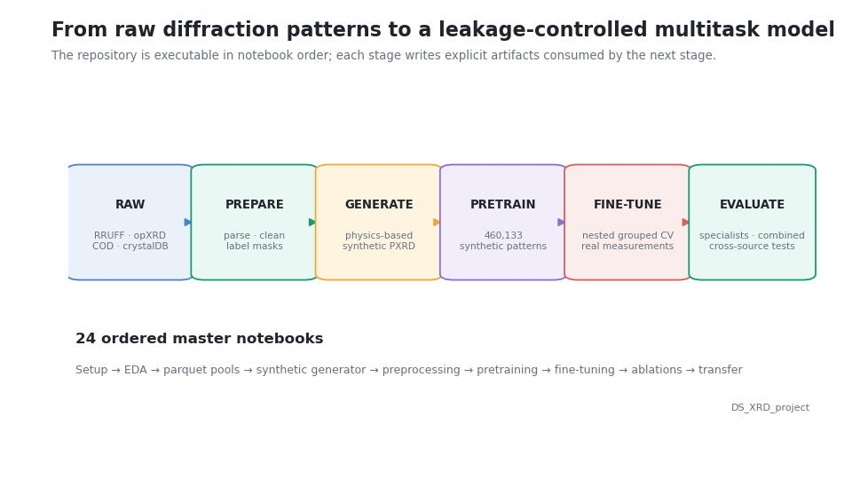

## Table of contents

- [Project scope](#project-scope)
- [Physical background](#physical-background)
- [Data sources and roles](#data-sources-and-roles)
- [Exploratory data analysis](#exploratory-data-analysis)
- [Synthetic PXRD generator](#synthetic-pxrd-generator)
- [Preprocessing and domain diagnostics](#preprocessing-and-domain-diagnostics)
- [Model and multitask objective](#model-and-multitask-objective)
- [Leakage control and the canonical key](#leakage-control-and-the-canonical-key)
- [Chronological experiment log](#chronological-experiment-log)
- [Final results](#final-results)
- [Why the combined no-replay model is final](#why-the-combined-no-replay-model-is-final)
- [Repository structure](#repository-structure)
- [Reproduction](#reproduction)
- [Version-control policy](#version-control-policy)
- [Limitations](#limitations)

## Project scope

PXRD is a many-to-one inverse problem. A measured pattern is affected not only by crystal structure, but also by wavelength, angular coverage, line broadening, preferred orientation, background, noise, sample preparation, phase composition, and instrument settings. Consequently, a large synthetic dataset can teach crystallographic regularities, but it cannot replace adaptation to measured data.

This repository tests the following strategy:

1. learn a shared diffraction representation from a large physics-based synthetic corpus;
2. fine-tune the representation on a much smaller real labeled pool;
3. keep missing targets through explicit head masks rather than fabricated labels;
4. evaluate with source-aware grouped cross-validation;
5. retain negative experiments and changed evaluation regimes instead of reporting only the best number.

### Current project snapshot

| Item | Current value |
|---|---:|
| Synthetic pretraining patterns | 460,133 |
| RRUFF real patterns | 1,359 |
| opXRD labeled real patterns | 2,116 |
| opXRD unlabeled patterns | 86,368 |
| Combined real fine-tuning pool | 3,475 |
| Final input length | 4,096 bins |
| Final backbone | XRDNet V2, 11.3M parameters |
| Outer evaluation | 5-fold grouped cross-validation |
| Final combined checkpoint | `ft_combined_no_replay_control_with_rruff_sg_final.pt` |

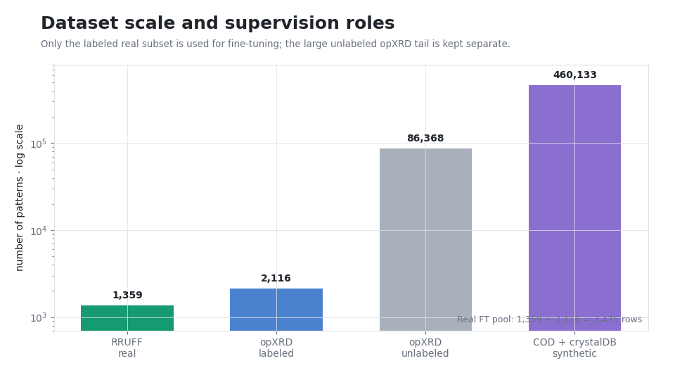

The final checkpoint is generated locally and deliberately excluded from Git. Its complete training configuration is stored in [`outputs/ft_combined_no_replay_control_with_rruff_sg_final_config.json`](outputs/ft_combined_no_replay_control_with_rruff_sg_final_config.json).

## Physical background

### Powder X-ray diffraction experiment

A powdered specimen contains many crystallites in different orientations. A monochromatic incident X-ray beam illuminates the sample, and a detector records diffracted intensity while the scattering angle \(2\theta\) changes. Because many orientations are present, crystallographic plane families satisfying the diffraction condition contribute peaks to a one-dimensional intensity profile.

Peak positions primarily encode interplanar spacings and unit-cell geometry. Relative intensities depend on the atoms inside the unit cell, their occupancies and positions, symmetry multiplicity, and experimental corrections. Peak widths and baselines additionally carry sample and instrument effects. The ML model therefore does not receive a direct image of a crystal; it receives a noisy, partially observed projection of several coupled physical processes.

### Bragg condition

For wavelength \(\lambda\), diffraction order \(n\), and interplanar spacing \(d_{hkl}\), a reflection occurs when

$$
2d_{hkl}\sin\theta = n\lambda.
$$

The set of \(d_{hkl}\) values depends on lattice parameters and crystal symmetry. This is why peak locations contain information about \(a,b,c,\alpha,\beta,\gamma\), but the inverse mapping is not unique under noise, missing angular ranges, mixed phases, or severe peak overlap.

### Atomic scattering and structure factor

The elastic atomic scattering factor is approximated as a function of

$$
s = \frac{\sin\theta}{\lambda},
$$

using a tabulated Gaussian expansion of the form

$$
f_0(s) = \sum_i a_i\exp(-b_i s^2) + c.
$$

For reflection \((hkl)\), the unit-cell structure factor is

$$
F_{hkl} = \sum_j o_j t_j f_j(s)
\exp\!\left[2\pi i(hx_j + ky_j + lz_j)\right],
$$

where \(o_j\) is occupancy, \(t_j\) collects thermal or attenuation terms, and \((x_j,y_j,z_j)\) are fractional atomic coordinates. A simplified powder-reflection intensity is then

$$
I_{hkl} \propto m_{hkl}\lvert F_{hkl}\rvert^2 LP(\theta),
$$

with reflection multiplicity \(m_{hkl}\) and Lorentz-polarization factor \(LP\).

### Broadening and nuisance effects

The generator randomizes effects that are not fixed by the ideal structure:

- wavelength and the \(K\alpha_1/K\alpha_2\) doublet;
- Caglioti-type instrumental broadening,
  \(H^2 = U\tan^2\theta + V\tan\theta + W\);
- finite crystallite-size broadening, approximately
  \(\beta \approx K\lambda/(D\cos\theta)\);
- preferred orientation and reflection-intensity perturbations;
- smooth background, local baseline changes, and measurement noise;
- angular-window truncation and sampling differences.

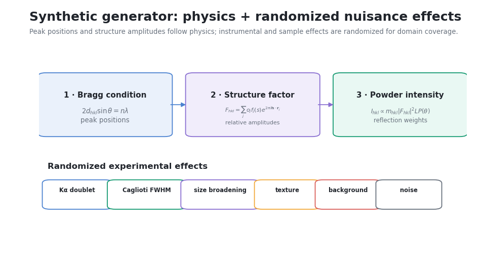

## Data sources and roles

Raw datasets are **not** stored in this repository. Their local paths are configured in `config/raw_sources.json`, which is machine-specific and ignored by Git. Start from [`config/raw_sources.example.json`](config/raw_sources.example.json).

| Source | Type | Rows retained | Role in this project |
|---|---|---:|---|
| RRUFF | measured mineral PXRD | 1,359 | real EDA, fine-tuning, grouped evaluation |
| opXRD | measured PXRD | 88,484 total | 2,116 labeled rows for fine-tuning; 86,368 rows kept unlabeled |
| COD | crystal structures | 324,875 usable structures | synthetic pretraining patterns |
| crystalDB | crystal structures | 135,258 usable structures | synthetic pretraining patterns |
| COD + crystalDB | generated PXRD | 460,133 | pretraining only |

The final combined real pool contains 3,475 rows:

- 2,406 single-phase rows;
- 1,069 multiphase rows;
- 2,653 rows with lattice supervision;
- 1,675 rows with space-group supervision;
- 2,684 rows with crystal-system supervision;
- 2,253 rows with element supervision.

These counts are not interchangeable. Every head uses its own binary availability mask, so a row may supervise one task and be ignored by another.

## Exploratory data analysis

The EDA is reproduced by [`notebooks/01_real_data_eda.ipynb`](notebooks/01_real_data_eda.ipynb). Parsing and final table construction are separated into [`notebooks/02_prepare_real_parquets.ipynb`](notebooks/02_prepare_real_parquets.ipynb) and [`notebooks/03_clean_pools_and_modes.ipynb`](notebooks/03_clean_pools_and_modes.ipynb).

### RRUFF

RRUFF contributes 1,359 cleaned patterns. Every retained row is single-phase. The measurements are comparatively regular in angular coverage and sampling, but labels remain incomplete: 1,105 rows receive a usable space-group label only after the later RRUFF–IMA enrichment step.

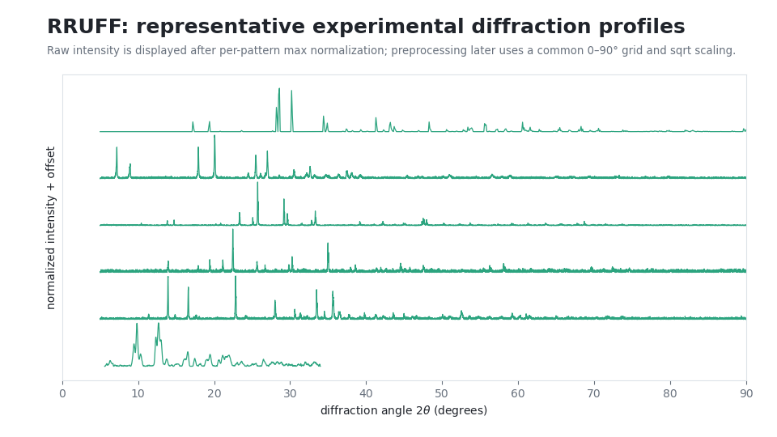

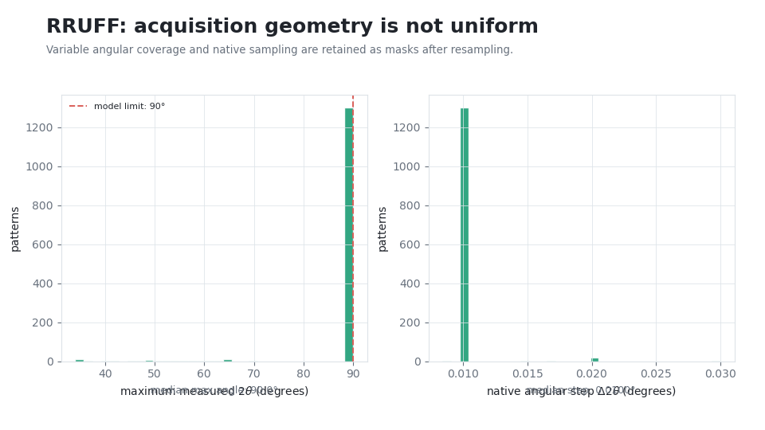

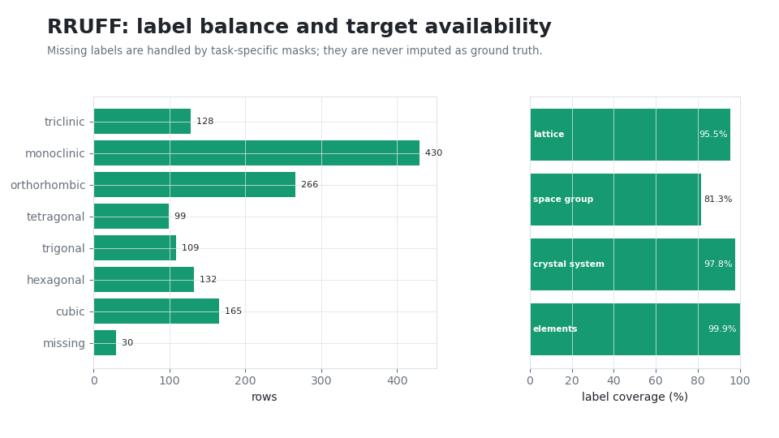

Key consequences for modeling:

- mineral families can have multiple measurements, so random row splitting is unsafe;
- the crystal-system distribution is imbalanced;
- exact element-set accuracy is strict because one missing or additional element makes the complete set incorrect;
- RRUFF and opXRD do not share identical label semantics or acquisition conditions.

### opXRD

opXRD contributes 88,484 cleaned patterns, but only 2,116 contain at least one usable supervised target in the real fine-tuning pool. Of those labeled rows, 1,047 are single-phase and 1,069 are multiphase. The other 86,368 rows are explicitly stored as unlabeled and never silently treated as ground truth.

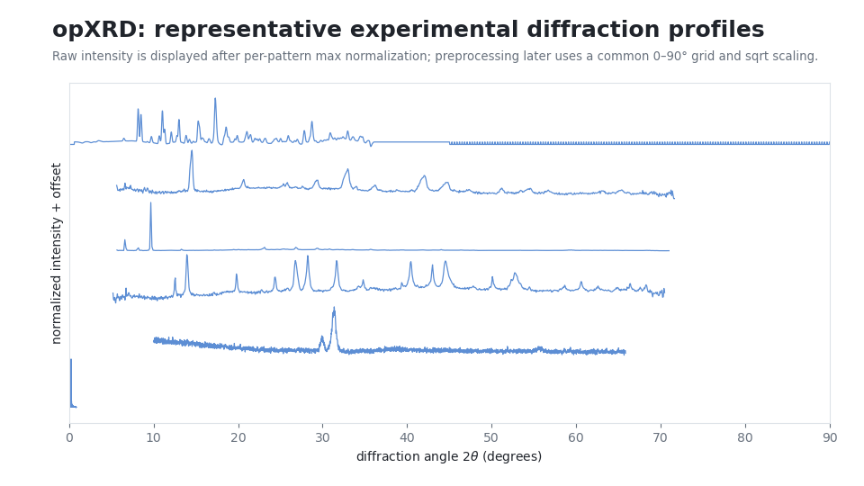

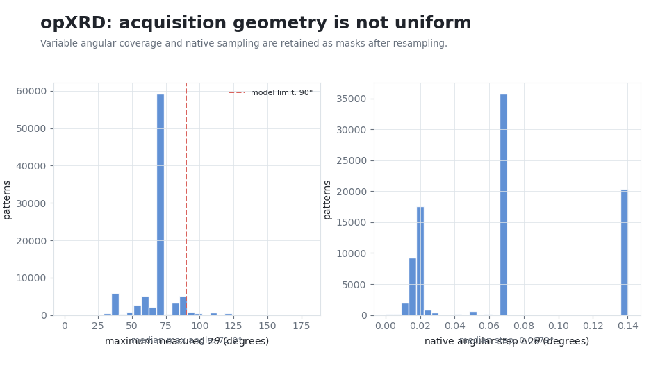

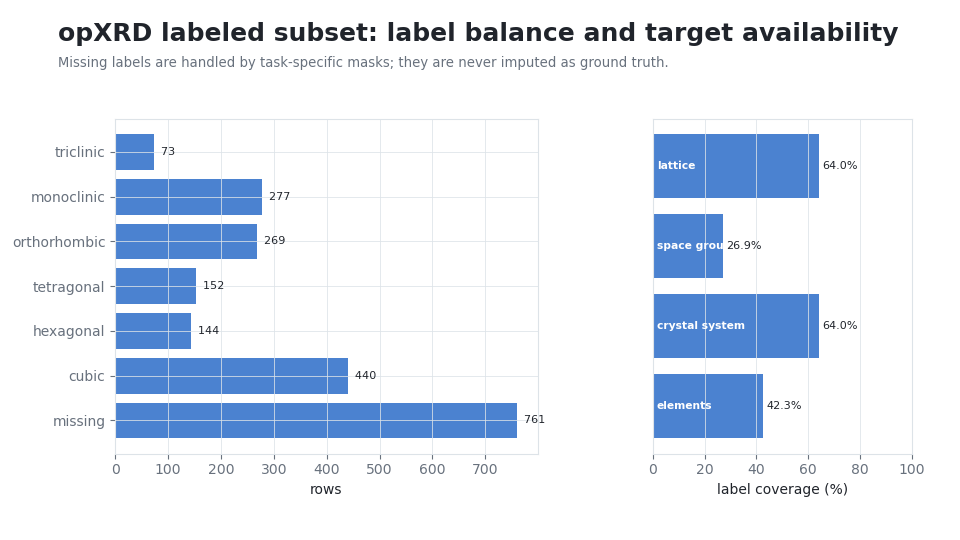

opXRD is much more heterogeneous than RRUFF:

- angular windows and native steps vary substantially;
- multiple wavelength regimes occur;
- many records do not contain crystallographic targets;
- labeled rows include both single-phase and multiphase measurements;
- some target heads are available for only a minority of the labeled subset.

### Real versus synthetic targets

The synthetic corpus is much larger but does not reproduce the real target distribution exactly. The lattice and volume proxy distributions below are shown after removing extreme plotting outliers only; this display filtering does not change training tables.

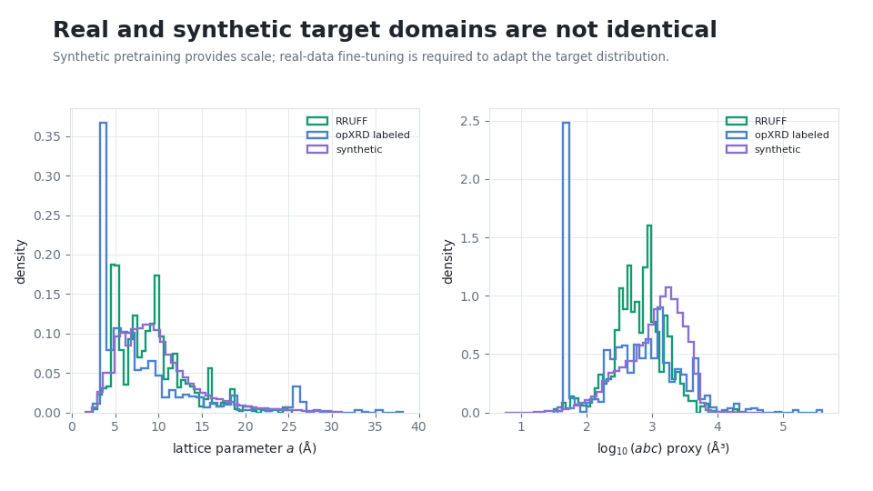

## Synthetic PXRD generator

The generator is project-specific code in [`src/synth_physics.py`](src/synth_physics.py), [`src/synth_run.py`](src/synth_run.py), and [`src/synth_finalize.py`](src/synth_finalize.py). It is not a copied end-to-end GitHub generator. It uses established crystallographic libraries and data tables—Gemmi, ASE, spglib, and atomic form-factor coefficients—but implements the project workflow, reflection calculation, profile construction, randomization, sharding, manifests, and recovery logic locally.

### Generation sequence

1. Read and validate a structure.
2. Standardize crystallographic information where possible.
3. Enumerate reflections in the requested angular window.
4. Calculate structure factors and ideal reflection weights.
5. Construct a continuous profile with randomized broadening.
6. Add wavelength effects, texture, background, and noise.
7. Save the spectrum and one metadata row.
8. Resume safely from completion manifests if generation is interrupted.

The final clean synthetic table contains exactly 460,133 rows:

- 324,875 generated from COD structures;
- 135,258 generated from crystalDB structures.

Generation and validation are controlled by [`notebooks/05_generate_synthetic.ipynb`](notebooks/05_generate_synthetic.ipynb). Structure-source preparation is performed first in [`notebooks/04_prepare_structure_sources.ipynb`](notebooks/04_prepare_structure_sources.ipynb).

### Independent engine validation

The custom reflection engine was checked on 190 structures against `pymatgen.analysis.diffraction.xrd.XRDCalculator`. The saved validation run reported:

- median profile correlation: **0.9975**;
- mean profile correlation: **0.9952**;
- fraction with correlation \(\ge 0.97\): **99.5%**.

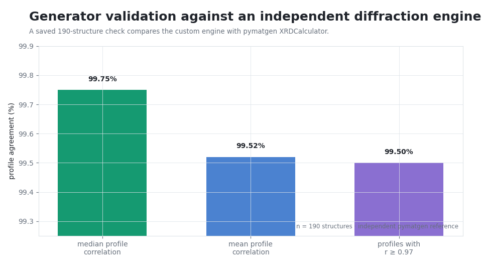

This validates the idealized diffraction engine against an independent implementation. It does **not** prove that synthetic patterns are indistinguishable from experimental measurements.

## Preprocessing and domain diagnostics

All sources are converted to one model representation in [`notebooks/06_preprocessing_and_domain_diagnostics.ipynb`](notebooks/06_preprocessing_and_domain_diagnostics.ipynb):

- common angular domain: \(0^\circ\) to \(90^\circ\) in \(2\theta\);
- fixed length: 4,096 intensity bins;
- square-root intensity transform followed by normalization;
- a validity mask that preserves which bins were actually observed;
- primary and secondary wavelength metadata;
- per-head target masks;
- stable train/fine-tune/unlabeled roles stored in the preprocessed index.

The final preprocessed index contains 549,976 rows:

| Split role | Rows |
|---|---:|
| Synthetic pretraining | 460,133 |
| Real fine-tuning | 3,475 |
| Unlabeled opXRD | 86,368 |

### Domain classifier diagnostic

A deliberately simple diagnostic classifier is trained to distinguish synthetic from real patterns within matched wavelength modes. ROC AUC remains between **0.9978 and 1.0000**. The strongest cues include angular coverage, intensity median, sparsity, noise autocorrelation, background statistics, FWHM, and peak density.

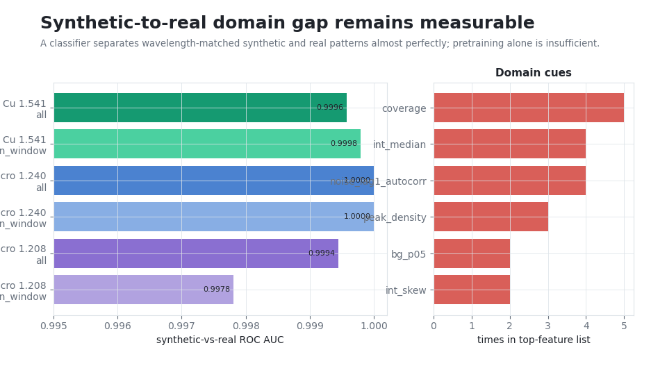

This result is not a model success metric. It is evidence of a severe residual domain gap and the reason zero-shot synthetic performance is treated only as a baseline.

## Model and multitask objective

XRDNet V2 is a 1D convolutional multitask network with approximately 11.3 million trainable parameters. The 4,096-bin signal, validity information, and wavelength metadata are encoded into a shared 1,536-dimensional representation. Four heads predict lattice quantities, space group, crystal system, and elements.

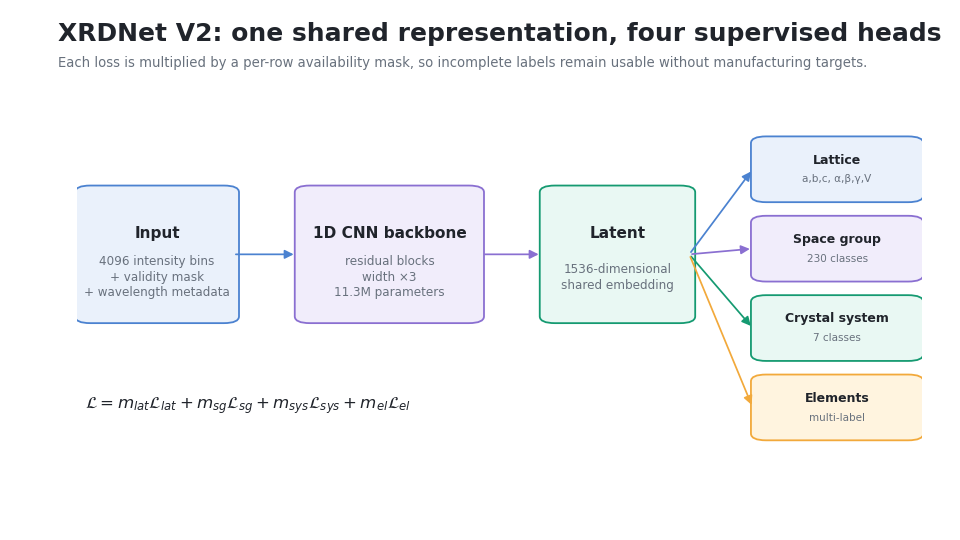

The total loss is masked per task:

$$
\mathcal{L} =
m_{lat}\mathcal{L}_{lat} +
m_{sg}\mathcal{L}_{sg} +
m_{sys}\mathcal{L}_{sys} +
m_{el}\mathcal{L}_{el},
$$

where each \(m\in\{0,1\}\) states whether that row has a valid target for the corresponding head. The model therefore uses partially labeled rows without converting missing values into negative classes or numerical zeros.

The training history includes two backbones:

- **V1:** about 1.37M parameters; retained as the first baseline;
- **V2:** about 11.3M parameters, width multiplied by three, 1,536-dimensional latent representation, and a higher weight on lattice-angle errors.

Synthetic pretraining is followed by real fine-tuning. The final combined model uses separate learning rates for backbone and heads, nested grouped validation, and no synthetic replay during the final real-data stage.

## Leakage control and the canonical key

The phrase “leakage-free” is too broad unless the identity rule is stated. This project is **leakage-controlled with respect to an explicit source-specific canonical grouping key**.

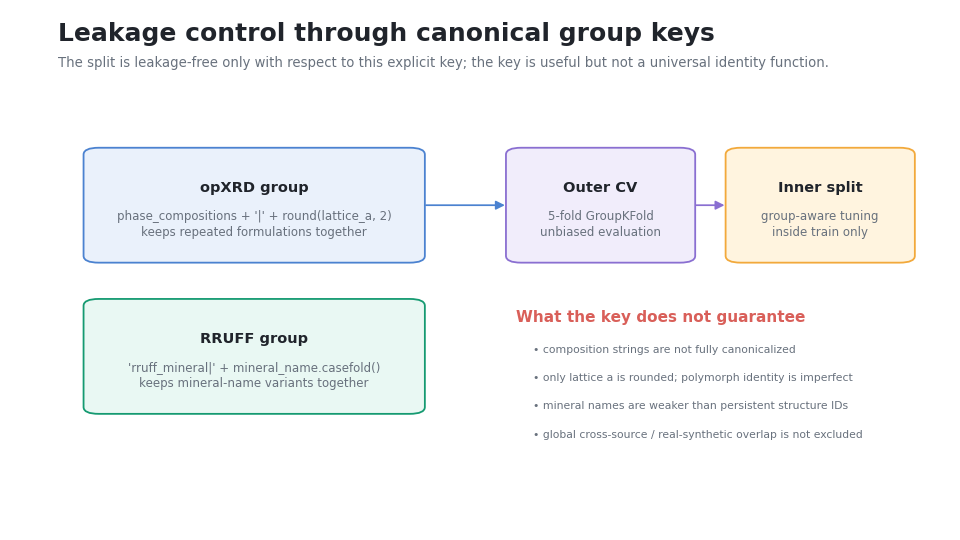

### Why row-level random splitting failed

Several spectra may describe the same material, mineral, or nearly identical structural record. If those rows are split independently, the model can see one realization during training and a closely related realization during validation. The resulting score measures recognition of repeated material identities, not generalization to unseen groups.

The historical fine-tuning V1 experiment used a random holdout and is retained only as a documented failed evaluation design. From V2 onward, all headline real-data results use grouped splitting.

### Exact key definitions

For opXRD, the grouping key is

```python
composition = frame["phase_compositions"].fillna("").astype(str)
frame["conn_key"] = composition + "|" + frame["lattice_a"].round(2).astype(str)
```

For RRUFF, the grouping key is

```python
frame["conn_key"] = (
    "rruff_mineral|"
    + frame["rruff_mineral_name"].fillna("").astype(str).str.casefold()
)
```

The split assertions require train and validation key sets to be disjoint. The final experiments use:

1. **outer 5-fold GroupKFold** for unbiased fold-wise evaluation;
2. a **group-aware inner split** inside each outer training fold for configuration and epoch selection;
3. paired source folds where relevant, so comparisons use the same outer test groups;
4. final full-pool fitting only after the evaluation configuration has been selected.

### What the key guarantees

Within a given source and experiment, rows sharing the defined `conn_key` cannot appear in both train and validation. This blocks the known duplicate/related-material leakage mode that invalidated the random holdout.

### What the key does not guarantee

The key is an engineering approximation, not a universal chemical identity:

- `phase_compositions` is serialized source metadata, not a fully normalized chemical graph;
- only lattice parameter \(a\) is rounded, to 0.01 Å; \(b,c\), angles, symmetry, and full structure are not part of the opXRD key;
- distinct polymorphs can collide if the composition string and rounded \(a\) coincide;
- related records can remain separate if composition strings differ syntactically;
- RRUFF mineral-name grouping is weaker than a persistent specimen or structure identifier;
- the grouping rule does not globally deduplicate RRUFF against opXRD;
- it does not prove that real structures are absent from COD or crystalDB synthetic pretraining;
- it does not eliminate acquisition-site, instrument, or temporal correlations.

The precise claim is therefore:

> Reported grouped-CV metrics are leakage-controlled for the defined source-specific canonical key. They are not proof of generalization to every unseen structure, instrument, laboratory, or database.

## Chronological experiment log

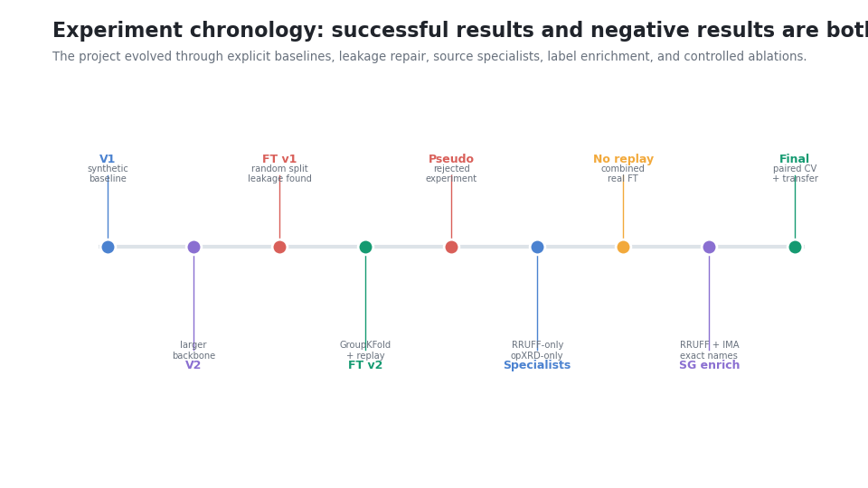

The notebooks are intended to be read and executed in numerical order. Every notebook represents one coherent task and writes artifacts used by later stages.

### Phase A — project setup and real-data construction

| Step | Notebook | Purpose | Main outputs |
|---:|---|---|---|
| 00 | [`00_project_setup.ipynb`](notebooks/00_project_setup.ipynb) | Validate the environment, create directories, and check configured raw sources. | project folders, source-path checks |
| 01 | [`01_real_data_eda.ipynb`](notebooks/01_real_data_eda.ipynb) | Explore RRUFF and opXRD independently: spectra, angular ranges, steps, wavelengths, labels, phases, and missingness. | EDA figures and tables under `reports/` |
| 02 | [`02_prepare_real_parquets.ipynb`](notebooks/02_prepare_real_parquets.ipynb) | Parse the original RRUFF JSON and opXRD hierarchy into normalized tabular records and raw spectrum arrays. | initial RRUFF/opXRD parquet tables |
| 03 | [`03_clean_pools_and_modes.ipynb`](notebooks/03_clean_pools_and_modes.ipynb) | Clean rows, build task masks, construct the fine-tuning pool, detect acquisition modes, and correct wavelength ordering. | clean real tables, mode CSVs, real FT pools |
| 04 | [`04_prepare_structure_sources.ipynb`](notebooks/04_prepare_structure_sources.ipynb) | Prepare COD and crystalDB structures and calculate/standardize space-group metadata where required. | structure metadata and `mp_sg.csv` |
| 05 | [`05_generate_synthetic.ipynb`](notebooks/05_generate_synthetic.ipynb) | Validate the custom engine, run pilot generation, generate full sharded corpora, and finalize a clean synthetic table. | synthetic shards, manifests, 460,133-row summary |
| 06 | [`06_preprocessing_and_domain_diagnostics.ipynb`](notebooks/06_preprocessing_and_domain_diagnostics.ipynb) | Resample every source to the common grid, build masks/arrays, and quantify synthetic-real and real-real domain gaps. | preprocessed arrays/index, [`domain_check_report.csv`](outputs/domain_check_report.csv) |

### Phase B — pretraining and leakage repair

| Step | Notebook | Purpose | Decision |
|---:|---|---|---|
| 07 | [`07_pretrain_v1.ipynb`](notebooks/07_pretrain_v1.ipynb) | Train the first 1D CNN multitask baseline on synthetic data. | Retained as the small baseline. |
| 08 | [`08_pretrain_v2.ipynb`](notebooks/08_pretrain_v2.ipynb) | Train the larger V2 backbone with increased width, latent size, and angle-loss weight. | Selected as the pretraining backbone. |
| 09 | [`09_compare_pretrains.ipynb`](notebooks/09_compare_pretrains.ipynb) | Compare V1 and V2 on synthetic validation and zero-shot real data. | V2 selected for downstream experiments. |
| 10 | [`10_finetune_v1.ipynb`](notebooks/10_finetune_v1.ipynb) | Historical random-holdout fine-tuning with synthetic replay. | Evaluation invalidated by group leakage; kept for chronology only. |
| 11 | [`11_finetune_v2.ipynb`](notebooks/11_finetune_v2.ipynb) | Replace the random holdout with five grouped folds and train from V2. | First leakage-controlled real-data baseline. |

### Phase C — negative experiment and alternative training regimes

| Step | Notebook | Purpose | Decision |
|---:|---|---|---|
| 12 | [`12_pseudo_labeling_failed_experiment.ipynb`](notebooks/12_pseudo_labeling_failed_experiment.ipynb) | Calibrate confidence thresholds on labeled data and attempt pseudo-labeling of 86,368 unlabeled opXRD rows. | Rejected for downstream training. SG and lattice pseudo-labels were disabled; pseudo-labels were not used in final models. |
| 13 | [`13_real_only_v2.ipynb`](notebooks/13_real_only_v2.ipynb) | Train the V2 architecture from scratch on real data. | Provides the no-pretraining control. |
| 14 | [`14_finetune_v3_staged.ipynb`](notebooks/14_finetune_v3_staged.ipynb) | Test a staged replay-then-real-only schedule with the same grouped folds. | No decisive advantage over the simpler path. |
| 15 | [`15_finetune_rruff_only.ipynb`](notebooks/15_finetune_rruff_only.ipynb) | Fine-tune and evaluate a RRUFF-only source specialist. | Establishes source-specific behavior. |
| 16 | [`16_finetune_opxrd_only.ipynb`](notebooks/16_finetune_opxrd_only.ipynb) | Fine-tune and evaluate an opXRD-only source specialist. | Establishes source-specific behavior. |
| 17 | [`17_finetune_combined_no_replay.ipynb`](notebooks/17_finetune_combined_no_replay.ipynb) | Fine-tune on combined real data without synthetic replay. | Simpler real adaptation selected; later repeated after RRUFF SG enrichment. |

### Phase D — RRUFF space-group enrichment and final models

| Step | Notebook | Purpose | Main outputs |
|---:|---|---|---|
| 18 | [`18_rruff_spacegroup_enrichment.ipynb`](notebooks/18_rruff_spacegroup_enrichment.ipynb) | Map RRUFF mineral names to IMA records using exact and normalized exact-name matching; reject unresolved ambiguity. | [`rruff_spacegroup_mapping_summary.json`](outputs/rruff_spacegroup_mapping_summary.json), enriched FT pools |
| 19 | [`19_finetune_rruff_only_with_rruff_sg.ipynb`](notebooks/19_finetune_rruff_only_with_rruff_sg.ipynb) | Retrain the RRUFF specialist with the new SG labels. | final RRUFF-only metrics/config/checkpoint |
| 20 | [`20_finetune_combined_with_rruff_sg.ipynb`](notebooks/20_finetune_combined_with_rruff_sg.ipynb) | Repeat combined no-replay FT on the SG-enriched pool with nested grouped CV. | final combined metrics/config/checkpoint |
| 21 | [`21_real_only_v2_with_rruff_sg.ipynb`](notebooks/21_real_only_v2_with_rruff_sg.ipynb) | Repeat the real-only control on the same enriched pool and folds. | directly comparable real-only control |

### Phase E — paired ablation, model comparison, and transfer

| Step | Notebook | Purpose | Main outputs |
|---:|---|---|---|
| 22 | [`22_single_phase_ablation.ipynb`](notebooks/22_single_phase_ablation.ipynb) | Compare all-real and single-phase-only FT with paired outer folds and the same optimizer-step budget. | paired summaries, multiphase diagnostic, single-phase checkpoint |
| 23 | [`23_model_comparison.ipynb`](notebooks/23_model_comparison.ipynb) | Read saved metrics and compare only compatible regimes; keep pre-enrichment and post-enrichment SG results separate. | comparison tables and plots |
| 24 | [`24_cross_source_transfer_evaluation.ipynb`](notebooks/24_cross_source_transfer_evaluation.ipynb) | Evaluate RRUFF-only on opXRD and opXRD-only on RRUFF without adaptation. | [`cross_source_transfer_metrics.csv`](outputs/cross_source_transfer_metrics.csv) |

## RRUFF space-group enrichment

The original RRUFF pool did not provide enough usable SG labels. Notebook 18 links RRUFF mineral names to IMA metadata under deliberately strict rules:

- 1,359 unique RRUFF IDs and 806 unique mineral names;
- 6,228 IMA records;
- no usable direct RRUFF IDs in the IMA table;
- 1,295 exact-name matches;
- 48 normalized exact-name matches;
- **no fuzzy matching**;
- 1,105 usable RRUFF SG labels, or 81.31% coverage;
- 93 represented space groups.

Ambiguous SG sets, unresolved symbols, missing SG values, name misses, and crystal-system conflicts remain explicitly marked instead of being forced to a class.

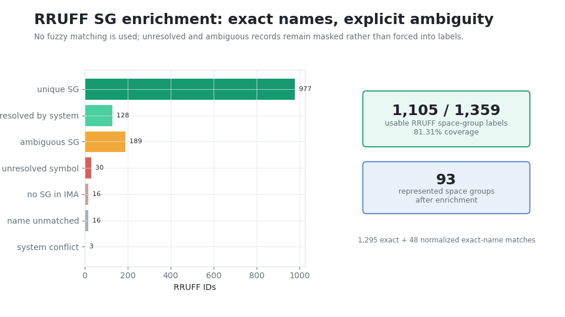

This enrichment changes the evaluation population. The earlier pre-enrichment combined SG score, computed almost entirely on opXRD SG labels, must not be compared directly with the post-enrichment score that includes 1,105 newly supervised RRUFF rows.

## Final results

### Combined SG-enriched regime

The table below is read from [`outputs/ft_combined_no_replay_control_with_rruff_sg_cv_summary.csv`](outputs/ft_combined_no_replay_control_with_rruff_sg_cv_summary.csv). Values are mean ± standard deviation across five outer grouped folds.

| Metric | Zero-shot V2 | Real-only control | Pretrain → combined FT |
|---|---:|---:|---:|
| Crystal-system accuracy | 34.63% | 52.41 ± 2.63% | **62.76 ± 1.77%** |
| Space-group top-1 | 17.37% | 25.02 ± 3.36% | **45.85 ± 5.97%** |
| Space-group top-5 | 40.04% | 51.14 ± 10.85% | **69.85 ± 6.37%** |
| Element micro-F1 | 18.10% | 55.26 ± 3.46% | **55.88 ± 4.27%** |
| Exact element-set accuracy | 0.17% | **21.72 ± 8.01%** | 19.09 ± 4.82% |
| MAE \(a\), Å | 3.467 | 2.967 ± 0.258 | **2.623 ± 0.331** |
| Median MAPE \(a\) | 34.24% | — | **19.14 ± 2.10%** |
| Mean angular MAE | 6.037° | **4.637 ± 0.394°** | 4.830 ± 0.125° |
| Median volume MAPE | 58.03% | — | **33.05 ± 1.87%** |

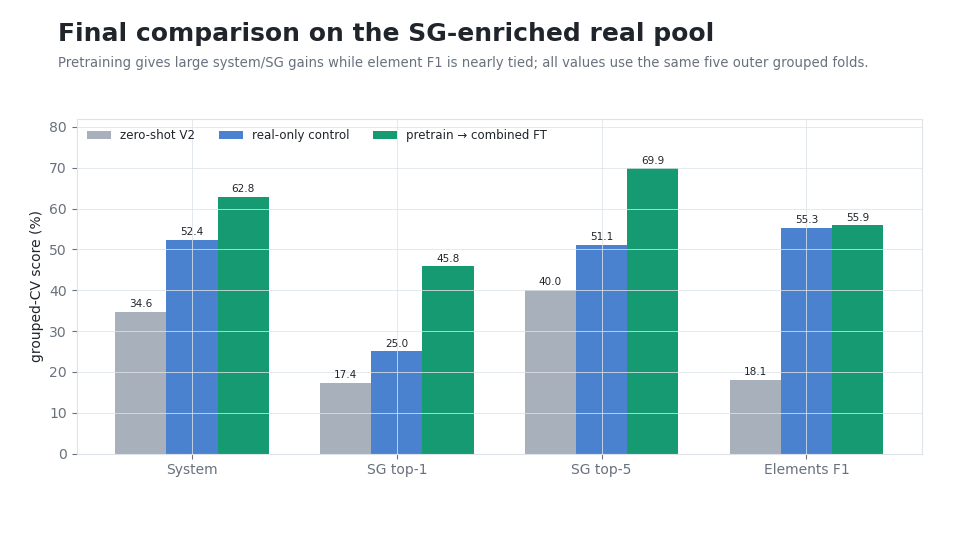

Synthetic pretraining clearly improves crystal-system classification, SG classification, and lattice \(a\) error. It does not dominate every metric: the real-only control is slightly better on exact element-set accuracy and mean angle MAE. The correct conclusion is therefore “better balanced multitask performance,” not “best on every head.”

### Final combined model by source

| Source | System accuracy | SG top-1 | SG top-5 | Element micro-F1 | Exact elements | MAE \(a\) | Mean angle MAE |
|---|---:|---:|---:|---:|---:|---:|---:|
| RRUFF | 57.34% | 42.15% | 66.73% | 54.31% | 0.96% | 2.645 Å | 5.746° |
| opXRD | 67.92% | 56.10% | 79.80% | 61.71% | 47.12% | 2.608 Å | 3.962° |

The large gap in exact element-set accuracy is a source/label-semantics warning. It is not evidence that diffraction suddenly contains less chemistry in RRUFF.

### Source specialists

Source-only models are evaluated on different test populations, so their within-source CV scores must not be read as one common leaderboard.

| Model and own-domain test | System accuracy | SG top-1 | SG top-5 | Element micro-F1 | Exact elements | MAE \(a\) | Angle MAE |
|---|---:|---:|---:|---:|---:|---:|---:|
| RRUFF-only + SG enrichment | 57.64% | 43.92% | 67.76% | 54.00% | 1.25% | 2.611 Å | 5.553° |
| opXRD-only | 69.65% | 53.71% | 73.32% | 62.84% | 47.62% | 2.564 Å | 3.954° |

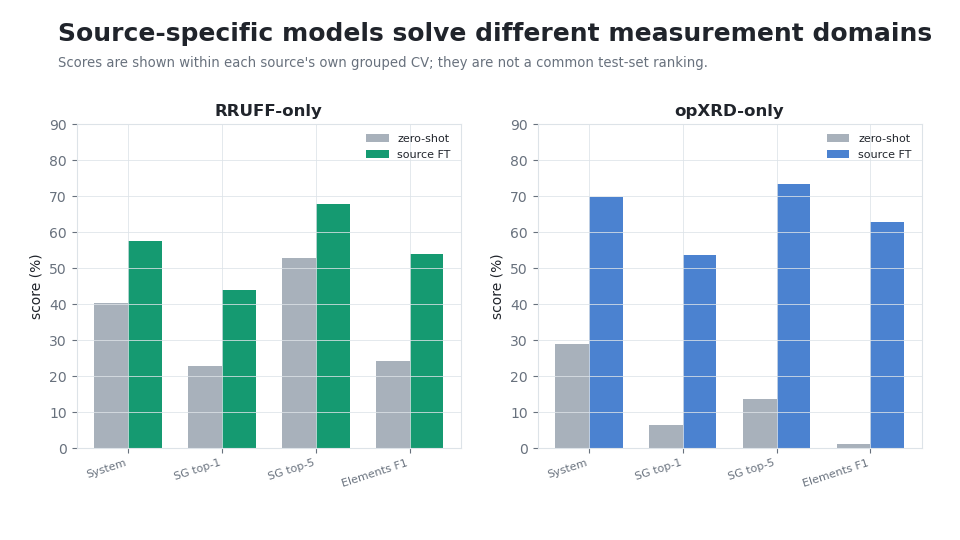

The opXRD specialist has very large fold-to-fold variation for SG and element metrics because supervision is sparse and unevenly distributed across groups. The mean alone is insufficient; the corresponding CSVs retain the fold standard deviations.

### Cross-source transfer

The source specialists were applied to the opposite source without fine-tuning.

| Direction | System accuracy | SG top-1 | SG top-5 | Element micro-F1 | Exact elements | MAE \(a\) | Angle MAE |
|---|---:|---:|---:|---:|---:|---:|---:|
| RRUFF-only → opXRD | 45.17% | 15.79% | 29.47% | 2.14% | 0.00% | 3.686 Å | 7.322° |
| opXRD-only → RRUFF | 39.88% | 18.19% | 44.62% | 10.93% | 0.00% | 3.280 Å | 6.950° |

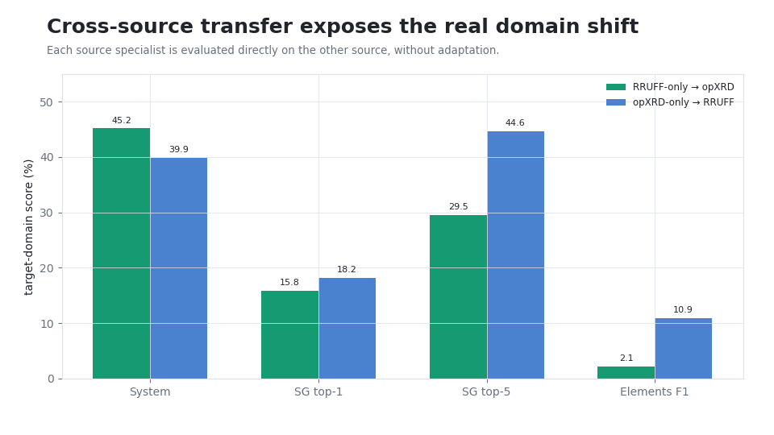

These results are the strongest evidence that source shift is not solved. A high in-domain grouped-CV score does not imply reliable transfer to a different experimental collection.

### Single-phase-only ablation

The single-phase experiment uses the same outer folds and a matched optimizer-step budget. On the shared single-phase evaluation rows, the single-phase-only arm changes headline metrics by only small amounts and not consistently in one direction. On the held-out multiphase diagnostic, the all-real model wins decisively on SG and element metrics.

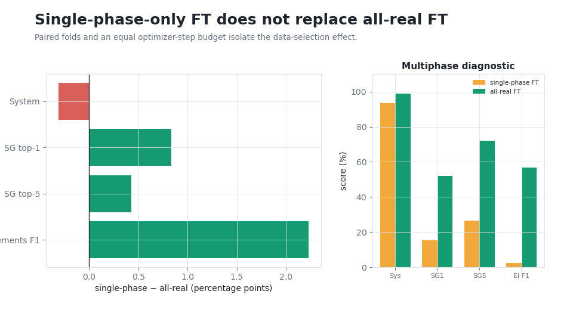

The result does not support replacing the all-real final model with the single-phase-only checkpoint.

### Pseudo-labeling: retained negative result

The pseudo-labeling registry is stored in [`outputs/pseudo_labels_registry.json`](outputs/pseudo_labels_registry.json):

- unlabeled opXRD rows considered: 86,368;
- rows receiving at least one pseudo-label: 15,951;
- crystal-system pseudo-labels: 16 at the conservative threshold;
- element pseudo-labels: 15,950;
- SG pseudo-labeling: disabled because no threshold achieved the required precision;
- lattice pseudo-labeling: disabled because no calibrated confidence estimate was available.

These pseudo-labels were **not used** in the final training pipeline. The experiment is preserved because it demonstrates that a large unlabeled pool is not automatically useful when confidence is miscalibrated under domain shift.

## Why the combined no-replay model is final

The selected final checkpoint is:

```text
checkpoints/ft_combined_no_replay_control_with_rruff_sg_final.pt
```

The suffix matters. `with_rruff_sg` identifies the post-enrichment label regime. An earlier `ft_combined_no_replay_control_final.pt` belongs to the pre-enrichment regime and is not the final checkpoint described here.

The final model is selected because it:

- trains on both real sources instead of specializing to one collection;
- starts from the stronger V2 synthetic pretraining checkpoint;
- uses the SG-enriched RRUFF pool;
- removes synthetic replay during the final real-adaptation stage;
- uses nested grouped CV and paired source folds;
- gives the strongest balanced result across system, SG, element F1, and lattice \(a\);
- remains directly comparable with the post-enrichment real-only control.

It is not selected because it wins every individual metric. It does not. Source specialists remain useful when deployment is known to match one source, and the real-only control is slightly better for exact element sets and angular MAE.

## Version-control policy

The repository is designed to keep code, notebooks, compact metrics, configurations, and curated documentation figures while excluding data that is large, reproducible, licensed separately, or machine-specific.

### Commit

- `README.md`, `requirements.txt`, and `.gitignore`;
- all source code under `src/`;
- all ordered master notebooks;
- `config/raw_sources.example.json` and non-sensitive configuration files;
- compact metric/config CSV and JSON files under `outputs/`;
- the 20 curated README figures under `docs/assets/readme/`.

### Do not commit

- raw RRUFF, opXRD, COD, crystalDB, or IMA data;
- generated parquet pools, NumPy arrays, spectrum shards, and preprocessing tensors;
- PyTorch checkpoints;
- large OOF prediction tables and temporary calibration arrays;
- per-spectrum report images and bulk diagnostic caches;
- local absolute-path configuration;
- presentations, IDE state, virtual environments, and notebook checkpoints.

If trained weights must be distributed, use a release asset or Git LFS and document the exact checksum. Do not silently add multi-gigabyte binaries to the main Git history.

## Limitations

1. **The real labeled pool is small.** The final model has only 3,475 real rows, with different masks per head.
2. **Domain shift is severe.** Synthetic-real ROC AUC near 1.0 and weak cross-source transfer show that neither pretraining nor within-source CV solves deployment shift.
3. **The canonical key is approximate.** It blocks the known grouping leakage but is not a global structure identity or database deduplication method.
4. **Multiphase targets are underspecified.** One lattice vector and one SG cannot faithfully represent every phase in a mixture. “Any matching phase,” “dominant phase,” and “sample-level chemistry union” are different targets and should not be conflated.
5. **RRUFF SG enrichment is name-based.** Exact-name rules avoid uncontrolled fuzzy matches but cannot remove all taxonomy and synonym errors.
6. **Label semantics differ by source.** The large RRUFF/opXRD gap in exact element-set accuracy is evidence that source annotations are not equivalent.
7. **Fold variance matters.** Sparse SG and element labels create high variance, especially for opXRD-only folds.
8. **Pseudo-label confidence was not reliable enough.** The unlabeled opXRD pool remains unused in final training.
9. **No calibrated predictive uncertainty is reported.** Regression errors and class probabilities should not be interpreted as confidence intervals.
10. **The final checkpoint is not a universal PXRD solver.** External laboratory and instrument validation is still required.

## Data and licensing note

Raw datasets remain under the terms of their original providers and are intentionally absent from this repository. This README does not grant redistribution rights for RRUFF, opXRD, COD, crystalDB, or IMA data. The repository should also include an explicit software license before third parties are invited to reuse the code; without one, normal copyright restrictions apply.

---

All headline numbers in this README are derived from the current post-enrichment result files. Historical pre-enrichment SG metrics are discussed only as a separate evaluation regime.
